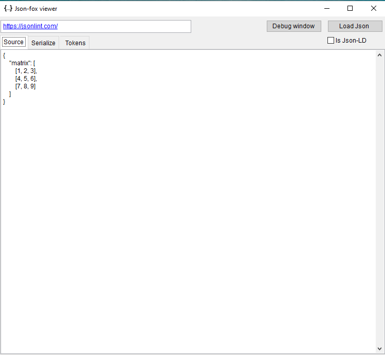

# JSON-Fox

JSON-Fox is a Visual FoxPro library for parsing, generating, and manipulating JSON data. It provides a set of classes and functions to work with JSON data in a convenient and efficient manner.

It includes the following components:

1. Tokenizer (Lexer): This component breaks the input JSON string into tokens. 
Each token represents a meaningful element such as a brackets 

object, array, date, string, number, boolean, or null.

2. Parser: This component processes the tokens generated by the tokenizer and builds a data structure (usually an object or array) that represents the JSON data.

3. Error Handling: This component handles any syntax errors encountered during parsing.

## Features

- **Parsing JSON**: Convert JSON strings into Visual FoxPro objects.
- **Generating JSON**: Convert Visual FoxPro objects into JSON strings with a beautify option.
- **Manipulating JSON**: Easily manipulate JSON data within Visual FoxPro.
- **Error Handling**: Handles syntax errors and provides meaningful error messages.
- **JSON-LD Support**: JSON-LD (JavaScript Object Notation for Linked Data) support for encoding linked data using JSON.
@ is converted to a property content starting with rdFoxprofix = "object_"
- **2D arrays**: Support for two-dimensional arrays, allowing for more complex data structures.

## Installation

To install JSON-Fox, download the library from the repository and include it in your Visual FoxPro project.

## Usage

### Parsing JSON

To parse a JSON string, use the `JsonParser` class:

```foxpro
LOCAL loParser, loJson
loParser = CREATEOBJECT("Parser")
loJson = loParser.ParseJson('{"name":"John Doe","age":30}')
? loJson.name  && Outputs: John Doe
? loJson.age   && Outputs: 30
```

### Generating JSON

To generate a JSON string from a Visual FoxPro object, use the JsonSerializer class:

```foxpro
LOCAL loSerializer, lcJson
loSerializer = CREATEOBJECT("Stringify")
* In JSON, the top-level structure can be an object, an array,
* or a single value (such as a string, number, boolean, or null).
lcJson = loSerializer.Stringify(lvValue, tlBeautify)
? lcJson  && Outputs: {"name":"John Doe","age":30}
```

### JsonHandler AS OLEPUBLIC 

```foxpro
DEFINE CLASS JsonHandler AS CUSTOM OLEPUBLIC
    PROCEDURE Serialize(loObject,tlBeautify)
        * Implementation for serializing JSON, see code ...
    ENDPROC

    PROCEDURE Deserialize(tcJson)
        * Implementation for deserializing JSON, see code
    ENDPROC
ENDDEFINE
```
### Json Test programs
* test_parser_scripts.prg   -> Scripts.json
```json
{
    "name": "ExampleScript",
    "description": "This is an example VFP script stored in JSON.",
    "script": "* Example VFP script\nLOCAL lcMessage\nlcMessage = \"Hello, World!\"\n? lcMessage"
}
```
* test_parse_matrix.prg     -> Testarraysmatrix.json
```json
{
    "matrix": [
        [1, 2, 3],
        [4, 5, 6],
        [7, 8, 9]
    ]
}
```
* test_jsonhandler_records.prg 

    Handle date without time and null ( empty) value  

```json
{"bblob":0,"cstring":"Sample String","ddate":"2025-01-23","ddouble":123.45,"ffloat":123,"iinteger":123,"lboolean":true,"mmemo":"Sample Memo","nnumber":123.45,"tdatetime":"2025-01-23T11:39:00Z","vvarchar":"Sample Varchar"}
```

Jsonviewer VFP form 



### License

This project is licensed under the MIT License by Marcel Desmet and Audielec S.A.
